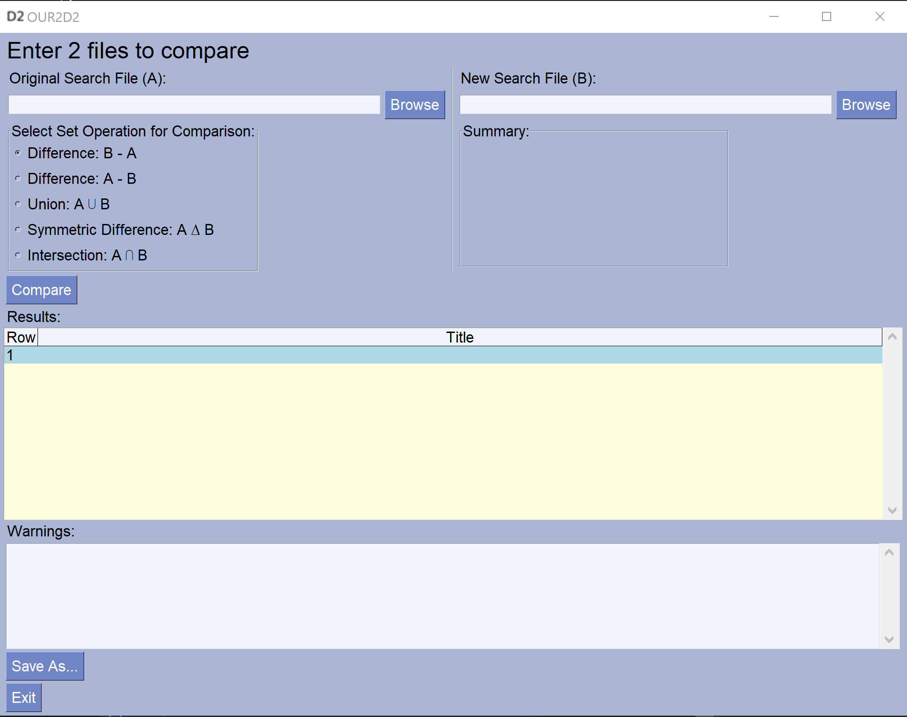

# Open Update Re-Run De-duplicate (OUR2D2)
For comparing article titles from journal databases with set operations.

---
**Requirements:** Python 3.6 if building from source

**Supported operating systems:** Windows

**Supported journal databases and formats:** EndNote XML, Embase CSV, PubMed CSV, 
  ProQuest CSV, Web of Science CSV, PsychInfo CSV, Lens CSV, Scopus CSV, and CINAHL CSV 
---

## Installation
A prebuilt executable is available [here](https://github.com/vangorden/OUR2D2/releases/download/v0.1-beta.2/OUR2D2.exe)
and on the [Releases](https://github.com/vangorden/OUR2D2/releases) page which is compiled for use on Windows.
Because this executable is unsigned, Windows will warn you against downloading and installing it.
If you are concerned about the security implications of using it, then you can follow the directions
below which will guide you through building it from source.

## Usage
Once you have downloaded the executable (or built it from source), started it, and ignored the 
security warnings, you can begin using it.

1. Select the files you wish to compare by clicking the "Browse" buttons, or by entering the file paths
in the text fields. 
2. Select the set operation you would like to perform to compare each of the files.
3. Select the "Compare" button.
4. At this point the table will be populated with the resulting article titles from the selected set
operation. If duplicate titles exist in either of the databases they will be displayed in the "Warnings"
box.
5. If you would like to save the resulting titles to a new CSV file select "Save As.." and choose the name
and location you would like to save it through the file browser.

## Caveats
At present OUR2D2 only differentiates articles by their title, it is possible that two different articles
will have the same title, if the two different articles with the same title exist in one of the databases,
the title of that article will be displayed in the "Warnings" box.

Article titles are compared by removing all punctuation, html entities, and XML tags, then converting them 
to lowercase, and attempting to normalize special characters. For example, the title 
"The Qüick: Bröwn \&amp; \<i>Fox\<i/>" will be converted to "thequickbrownfox".

The supported journal databases and formats are listed at the top of this file, but any CSV file with a column
heading of "Title", "title", "TI", or "Article Title" should work.

OUR2D2 is currently built and tested on Windows 10, building or running the project source code on other 
platforms should also work, but may require additional configuration and/or introduce some bugs. 

## Build From Source
The following instructions assume that the user is familiar with running Python programs from the command
line, installing Python packages, and has git installed.

1. Download the source with git or as a zip file from github and extract it.
`git clone https://github.com/vangorden/OUR2D2.git`
2. Navigate into the cloned git directory `cd OUR2D2`
3. Install the required python packages (ideally within a virtual environment) `pip install -r requirements.txt`
4. At this point the application can be run with Python or built into an executable. To run the application
with Python enter `python .\src\main.py`. To build the application run `pyinstaller -i .\assets\icon.ico -wF .\src\main.py`
once the build process is complete the executable can be found at `.\dist\main.exe`

## License
GNU Lesser General Public License (LGPL 3) +

## Acknowledgments
This creation of this application would not have been possible without [PySimpleGUI](https://github.com/PySimpleGUI/PySimpleGUI),
[PyInstaller](http://www.pyinstaller.org/), and of course [Python](https://www.python.org/)